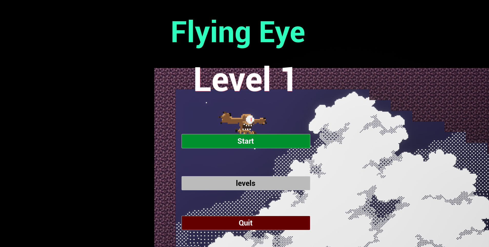
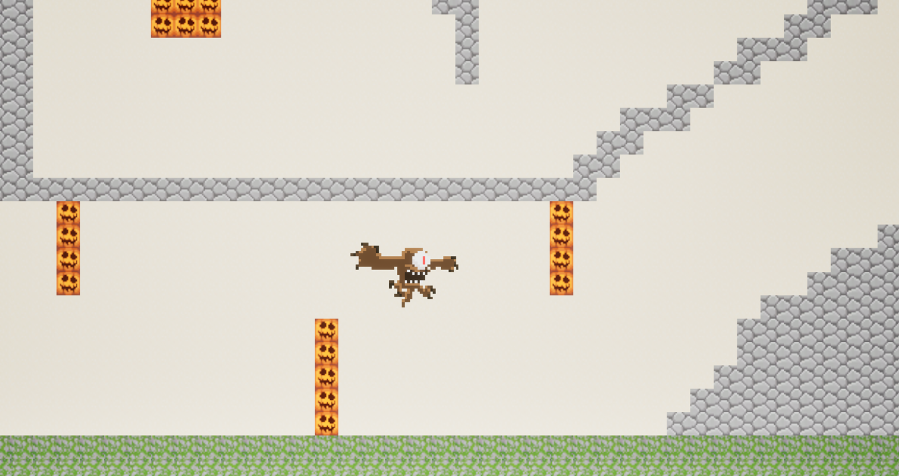

🎮 My First Unreal 2D Game
🚀 Play the Game: https://viru-theswordking.itch.io/flying-eye

🧠 About the Game
Flying Eye is a 2D game developed using Unreal Engine where the player controls a flying entity(eye) and navigates(by clicking space bar) through a dynamic environment.
This project represents my first step into game development, focusing on gameplay mechanics, cross-platform support, and immersive design using sound effects.

The objective is to control the flying eye and avoid obstacles by timing upward movements precisely.

🎮 Controls
  💻 PC Controls
    ⬆️ Up Arrow Key or Spacebar → Move/Fly Up
  📱 Mobile Controls
    👆 Touch Screen → Move/Fly Up
    🔊 Volume Up Button → Move/Fly Up

🎯 Features
👁️ Unique flying character gameplay
🎮 Smooth player controls
🔊 Integrated sound effects for better immersion
📱 Cross-platform support (PC + Mobile)
⚡ Real-time interactions
🌍 Simple and engaging level design

🛠️ Tech Stack
Game Engine: Unreal Engine
Development: Blueprints 
Platforms: Windows (PC) & Mobile

🎮 Game Versions
💻 PC Version – Play on laptop/desktop
📱 Mobile Version – Play on Android devices

👉 Both versions available here:
https://viru-theswordking.itch.io/flying-eye

📸 Screenshots

🎥 Gameplay
Play the game here:
👉 https://viru-theswordking.itch.io/flying-eye

🚀 How to Run Locally
1) Clone the repository
2) Open .uproject file in Unreal Engine
3) Click Play

📂 Project Structure
Content/ → Game assets
Config/ → Settings
.uproject → Main project file

🎓 Learning Outcomes
Built a complete game using Unreal Engine
Implemented sound effects for immersive gameplay
Developed cross-platform builds (PC + Mobile)
Learned version control using Git & GitHub

⭐ If you like this project, consider giving it a star!
